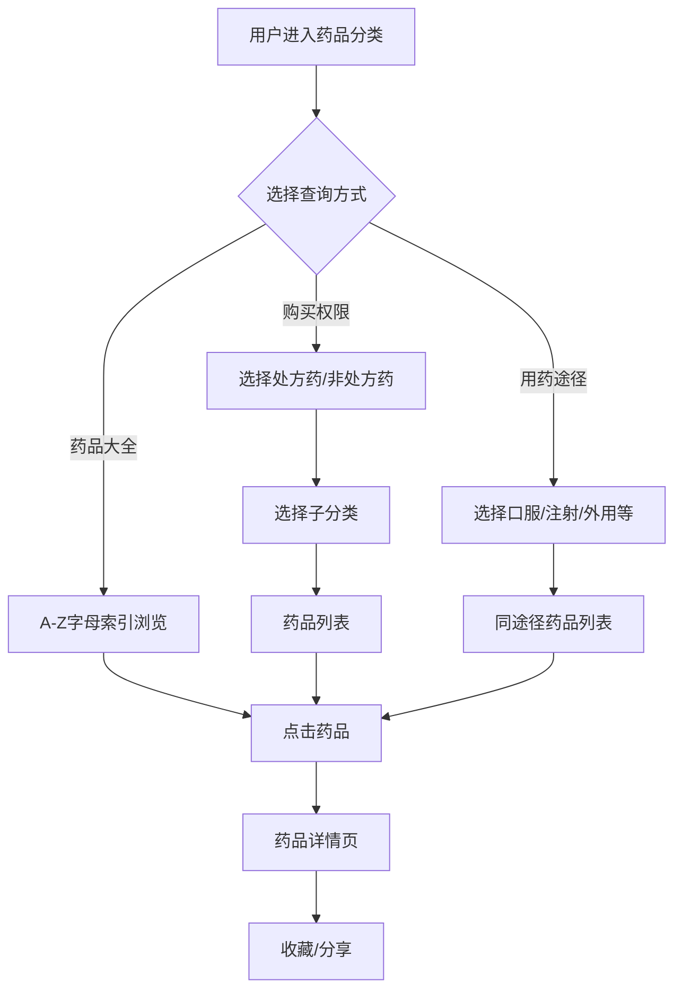
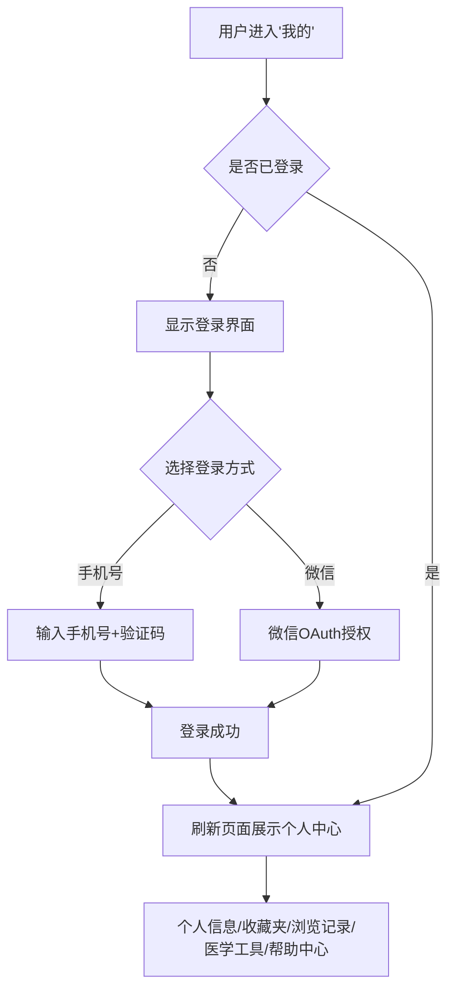
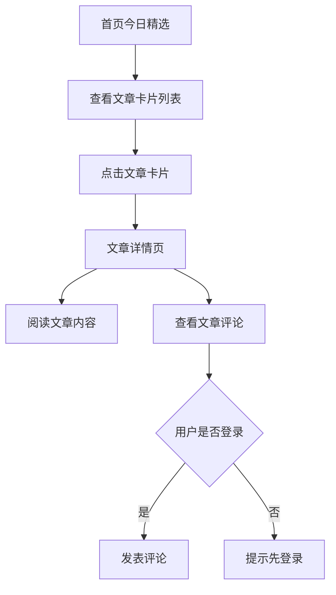

## 1. 产品概述

智慧药房是一个面向大众用户的**药品信息查询与健康知识平台**，采用移动端优先的底部三Tab导航交互模式。用户可快速检索药品信息（按首字母、按分类、按用药途径多维度查询）、阅读健康资讯文章并评论互动、管理个人收藏与浏览记录。**本平台不涉及任何药品交易功能。**

- **目标用户**：普通消费者/患者，需要查询药品信息、了解健康知识的广大用户群体
- **核心价值**：药品信息一站式查询 + 健康资讯聚合 + AI 智能问答 + 个人知识管理

## 2. 核心功能

### 2.1 用户角色

| 角色 | 注册方式 | 核心权限 |
|------|---------|---------|
| 普通用户 | 手机号/微信登录 | 浏览药品信息、阅读文章、评论、收藏、浏览记录 |

### 2.2 功能模块

1. **首页**：顶部多功能搜索区（文字搜索 + 拍照识别 + AI大模型对话）、今日精选文章列表
2. **药品分类**：药品大全（A-Z索引）、购买权限分类（处方药/非处方药）、用药途径分类（口服/注射/外用等）
3. **我的**：登录/注册、个人信息、收藏夹管理、浏览记录、医学工具、帮助中心
4. **药品详情页**：药品完整信息展示（基本信息、图片、说明书）、收藏功能
5. **文章详情页**：文章富文本展示、评论互动

### 2.3 页面详情

| 页面名称 | 模块名称 | 功能描述 |
|---------|---------|---------|
| 首页 | 搜索区 | 顶部固定搜索框，支持文字输入搜索药品；右侧拍照按钮可调起摄像头拍照识药；右侧AI入口可进入大模型对话界面 |
| 首页 | 今日精选 | 以卡片列表展示健康科普文章、医药新闻，每张卡片包含封面图、标题、摘要、来源、时间；下拉刷新；点击进入文章详情 |
| 药品分类 | 药品大全入口 | 顶部卡片入口，点击进入A-Z首字母索引全药品列表页 |
| 药品分类 | 购买权限入口 | 处方药 / 非处方药两个大分类入口卡片，点击进入对应子分类页 |
| 药品分类 | 用药途径入口 | 口服 / 注射 / 外用 / 吸入等用药途径入口，点击进入对应途径药品列表 |
| 药品大全页 | 首字母索引 | 右侧固定A-Z字母索引导航栏，点击字母快速跳转到对应药品分组 |
| 药品大全页 | 药品列表 | 按首字母分组展示所有药品，每组有字母分组标题；每项药品展示名称、规格、厂家、缩略图 |
| 药品详情页 | 基本信息区 | 药品名称、通用名、规格、剂型、生产厂家、批准文号 |
| 药品详情页 | 药品图片 | 药品包装图片轮播展示 |
| 药品详情页 | 说明书区 | 适应症、用法用量、不良反应、禁忌、注意事项等 |
| 药品详情页 | 操作区 | 收藏按钮（加入收藏夹）、分享按钮 |
| 文章详情页 | 文章内容 | 标题、封面图、正文富文本内容、来源、发布时间 |
| 文章详情页 | 评论区 | 评论列表、发表评论输入框、评论点赞 |
| 我的（未登录） | 登录入口 | 手机号登录 / 微信登录按钮 |
| 我的（已登录） | 个人信息 | 头像、昵称展示，点击可编辑 |
| 我的（已登录） | 收藏夹 | 收藏夹列表，支持新建/重命名/删除收藏夹，点击进入查看收藏药品 |
| 我的（已登录） | 浏览记录 | 最近100条浏览记录，按时间倒序，点击可跳转回详情 |
| 我的（已登录） | 医学工具 | 医学工具入口列表（BMI计算器等） |
| 我的（已登录） | 帮助中心 | 常见问题、使用指南、意见反馈、关于我们 |
| 搜索页 | 搜索结果 | 搜索关键字展示、药品搜索结果列表、空状态提示 |
| AI对话页 | 大模型对话 | 对话界面，用户输入问题，AI回复；底部免责声明"仅供参考，不构成医疗建议" |

## 3. 核心流程

### 3.1 药品查询流程

### 3.2 用户登录与个人管理流程

### 3.3 文章浏览与评论流程

## 4. 用户界面设计

### 4.1 设计风格

- **整体风格**：现代医疗健康风格，简洁清爽，传递专业可信赖感
- **主色调**：以清新的医疗绿（#0891B2 青碧色系）为主色调，搭配温暖的中性灰白背景
- **辅助色**：橙色（#F59E0B）用于强调和交互反馈
- **背景色**：浅灰白（#F8FAFC），卡片纯白（#FFFFFF）
- **文字色**：主文字 #1E293B，次要文字 #64748B，辅助文字 #94A3B8
- **字体**：标题使用 "Noto Serif SC"（思源宋体）体现专业感，正文使用系统默认无衬线字体保证可读性
- **圆角**：卡片 16px 大圆角，按钮 8px 圆角，营造亲和感
- **阴影**：卡片使用轻柔阴影（0 2px 8px rgba(0,0,0,0.06)），避免沉重感
- **图标**：线性图标风格，简洁现代
- **布局**：移动端优先单列布局（375px基准），底部固定Tab导航栏

### 4.2 页面设计概览

| 页面名称 | 模块名称 | UI元素 |
|---------|---------|--------|
| 首页 | 搜索区 | 顶部固定，白色背景，圆角搜索框，36px高度，内含搜索图标和placeholder文字"搜索药品名称"；右侧两个圆形图标按钮：拍照和AI |
| 首页 | 今日精选 | 卡片列表，每张卡片包含16:9封面图、标题（18px加粗）、摘要（14px灰色2行截断）、底部来源+时间；卡片间距12px；下拉刷新动画 |
| 药品分类 | 三大入口 | 三个横向排列的入口卡片，每张包含图标+标题+副标题，卡片有轻微渐变背景 |
| 药品大全 | 字母索引 | 右侧固定40px宽的字母导航条，半透明背景，字母12px；左侧药品列表按字母分组 |
| 药品详情 | 图片轮播 | 顶部大图轮播区域，300px高度，圆角；下方信息卡片分区展示 |
| 文章详情 | 内容区 | 顶部封面大图，标题24px宋体加粗，正文16px行高1.8，章节间留白充裕 |
| 我的 | 登录界面 | 居中登录卡片，品牌Logo，手机号/微信两个登录按钮，底部隐私协议链接 |
| 我的 | 个人中心 | 顶部用户信息卡片（头像+昵称），下方功能列表（图标+标题+右箭头），采用分组卡片布局 |

### 4.3 响应式设计

- **移动端优先**：以 375px 为设计基准，适配 320px - 428px 主流手机屏幕
- **平板适配**：768px 以上采用两列或居中最大宽 480px 布局
- **桌面端适配**：1024px 以上居中展示，最大宽度 480px，背景使用浅灰色模拟移动端体验
- **触摸优化**：按钮最小点击区域 44x44px，列表项高度不低于 48px

## 5. MVP范围

第一阶段（本期实现）包含以下核心功能：

1. 首页搜索区（文字搜索+A I入口，拍照识药入口预留）
2. 首页今日精选文章列表
3. 药品分类三大入口及完整药品查询流程
4. 药品大全A-Z索引页
5. 药品详情页
6. 文章详情页+评论
7. 我的模块（登录、个人信息、收藏夹、浏览记录）
8. 搜索功能
9. AI对话页（接入大模型API）

P2功能（后期迭代）：拍照识药OCR、医学工具具体功能、文章点赞等
