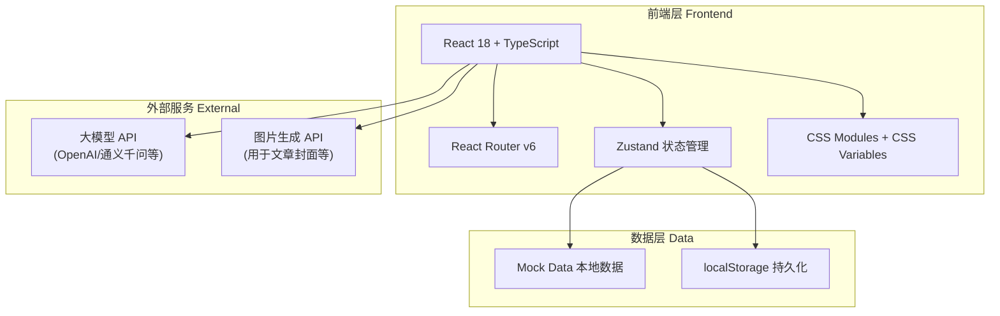
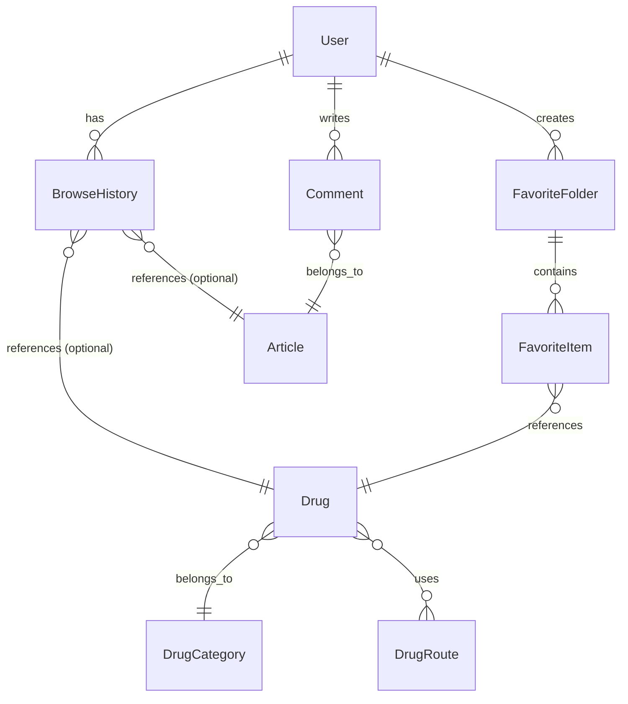

## 1. 架构设计



## 2. 技术选型

| 类别 | 技术 | 版本 | 说明 |
|------|------|------|------|
| 前端框架 | React | ^18 | 函数组件 + Hooks |
| 语言 | TypeScript | ^5 | 类型安全 |
| 构建工具 | Vite | ^5 | 快速开发构建 |
| 路由 | React Router DOM | ^6 | Hash 路由，支持嵌套路由 |
| 状态管理 | Zustand | ^4 | 轻量级状态管理 |
| 样式方案 | CSS Modules | - | 组件级样式隔离，配合 CSS Variables 实现主题 |
| 图标 | Lucide React | latest | 现代线性图标库 |
| HTTP 请求 | fetch API | - | 原生 fetch 封装 |
| 大模型 API | OpenAI / 通义千问 | - | 通过 API Key 调用 |
| 无后端 | Mock Data | - | 本地 JSON 模拟数据，localStorage 持久化 |

## 3. 路由定义

| 路由 | 页面 | 说明 |
|------|------|------|
| `/home` | 首页 | Tab1 默认页，搜索区 + 今日精选 |
| `/drug-category` | 药品分类 | Tab2 默认页，三大查询入口 |
| `/drug-category/all` | 药品大全 | A-Z 首字母索引全药品列表 |
| `/drug-category/auth` | 购买权限分类 | 处方药/非处方药 → 子分类 |
| `/drug-category/auth/:type` | 购买权限子分类 | 具体分类下的药品列表 |
| `/drug-category/route` | 用药途径 | 口服/注射/外用等途径 |
| `/drug-category/route/:type` | 用药途径列表 | 某途径下的药品列表 |
| `/drug/:id` | 药品详情页 | 药品完整信息展示 |
| `/mine` | 我的 | Tab3 默认页，已登录展示个人中心，未登录展示登录引导 |
| `/mine/login` | 登录页 | 手机号/微信登录 |
| `/mine/favorites` | 收藏夹管理 | 收藏夹列表及管理 |
| `/mine/favorites/:id` | 收藏夹详情 | 某收藏夹内的药品列表 |
| `/mine/history` | 浏览记录 | 最近100条浏览记录 |
| `/mine/tools` | 医学工具 | 工具入口列表 |
| `/mine/help` | 帮助中心 | FAQ、反馈、关于 |
| `/search` | 搜索结果 | 药品搜索结果列表 |
| `/ai-chat` | AI对话 | 大模型对话界面 |
| `/article/:id` | 文章详情 | 文章内容 + 评论区 |

## 4. 数据模型

### 4.1 实体关系图



### 4.2 TypeScript 类型定义

```typescript
// 用户
interface User {
  id: string;
  phone: string;
  nickname: string;
  avatar: string;
  wxOpenId?: string;
  createdAt: string;
}

// 药品
interface Drug {
  id: string;
  name: string;           // 药品名称
  genericName: string;    // 通用名
  pinyin: string;         // 拼音首字母(用于A-Z索引)
  firstLetter: string;    // 首字母 A-Z
  isPrescription: boolean;// 是否处方药
  categoryId: string;     // 分类ID
  categoryName: string;   // 分类名称
  routes: string[];       // 用药途径
  specification: string;  // 规格
  dosage: string;         // 剂型
  manufacturer: string;   // 生产厂家
  approvalNo: string;     // 批准文号
  barcode: string;        // 条形码
  imageUrls: string[];    // 药品图片
  indication: string;     // 适应症
  usage: string;          // 用法用量
  adverseReactions: string;// 不良反应
  contraindication: string;// 禁忌
  precautions: string;    // 注意事项
  storage: string;        // 贮藏
  validPeriod: string;    // 有效期
  createdAt: string;
}

// 药品分类
interface DrugCategory {
  id: string;
  name: string;
  parentId: string | null; // 父分类ID，null为顶级
  type: 'prescription' | 'otc' | 'general';
}

// 文章
interface Article {
  id: string;
  title: string;
  summary: string;
  content: string;        // HTML 富文本
  coverImage: string;
  tags: string[];
  source: string;
  author: string;
  viewCount: number;
  commentCount: number;
  publishedAt: string;
}

// 评论
interface Comment {
  id: string;
  articleId: string;
  userId: string;
  nickname: string;
  avatar: string;
  content: string;
  createdAt: string;
}

// 收藏夹
interface FavoriteFolder {
  id: string;
  userId: string;
  name: string;
  coverImage?: string;
  itemCount: number;
  createdAt: string;
}

// 收藏项
interface FavoriteItem {
  id: string;
  folderId: string;
  drugId: string;
  createdAt: string;
}

// 浏览记录
interface BrowseHistory {
  id: string;
  userId: string;
  targetType: 'drug' | 'article';
  targetId: string;
  title: string;
  coverImage: string;
  createdAt: string;
}
```

## 5. 状态管理设计

```typescript
// Zustand Store 设计
interface AppStore {
  // 用户状态
  user: User | null;
  isLoggedIn: boolean;
  login: (user: User) => void;
  logout: () => void;
  
  // 搜索历史
  searchHistory: string[];
  addSearchHistory: (keyword: string) => void;
  clearSearchHistory: () => void;
  
  // 浏览记录
  addBrowseRecord: (record: Omit<BrowseHistory, 'id' | 'userId' | 'createdAt'>) => void;
  
  // 收藏夹
  favoriteFolders: FavoriteFolder[];
  favoriteItems: FavoriteItem[];
  createFolder: (name: string) => void;
  deleteFolder: (id: string) => void;
  toggleFavorite: (drugId: string, folderId: string) => void;
}
```

## 6. 项目目录结构

```
智慧药房/
├── index.html
├── package.json
├── tsconfig.json
├── vite.config.ts
├── public/
│   └── images/               # 静态图片资源
├── src/
│   ├── main.tsx              # 入口文件
│   ├── App.tsx               # 根组件，路由配置
│   ├── App.module.css
│   ├── index.css             # 全局样式 + CSS Variables
│   ├── types/                # TypeScript 类型定义
│   │   └── index.ts
│   ├── mock/                 # Mock 数据
│   │   ├── drugs.ts
│   │   ├── articles.ts
│   │   └── comments.ts
│   ├── store/                # Zustand 状态管理
│   │   └── index.ts
│   ├── hooks/                # 自定义 Hooks
│   │   └── useAuth.ts
│   ├── utils/                # 工具函数
│   │   └── index.ts
│   ├── components/           # 公共组件
│   │   ├── TabBar/           # 底部导航栏
│   │   ├── SearchBar/        # 搜索栏
│   │   ├── DrugCard/         # 药品卡片
│   │   ├── ArticleCard/      # 文章卡片
│   │   ├── LetterIndex/      # 字母索引导航
│   │   ├── CommentSection/   # 评论区
│   │   └── EmptyState/       # 空状态
│   └── pages/                # 页面组件
│       ├── Home/
│       ├── DrugCategory/
│       ├── DrugAll/
│       ├── DrugAuth/
│       ├── DrugRoute/
│       ├── DrugDetail/
│       ├── Mine/
│       ├── Login/
│       ├── Favorites/
│       ├── History/
│       ├── Search/
│       ├── AiChat/
│       ├── ArticleDetail/
│       ├── Tools/
│       └── Help/
```

## 7. 开发计划

1. 项目初始化：Vite + React + TypeScript 脚手架搭建
2. 全局样式与 CSS Variables 配置
3. 底部 TabBar + Hash 路由配置
4. Mock 数据准备（药品50+条、文章10+篇、评论样例）
5. Zustand Store 状态管理搭建
6. 公共组件开发（TabBar、SearchBar、DrugCard、ArticleCard 等）
7. 首页模块开发
8. 药品分类模块开发（含药品大全、购买权限、用药途径）
9. 药品详情页开发
10. 我的模块开发（登录、收藏夹、浏览记录）
11. 文章详情页与评论功能
12. AI对话页
13. 搜索功能
14. 整体调试与优化
